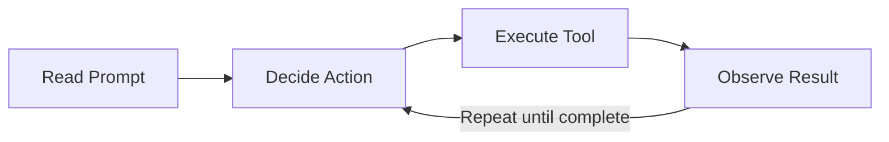
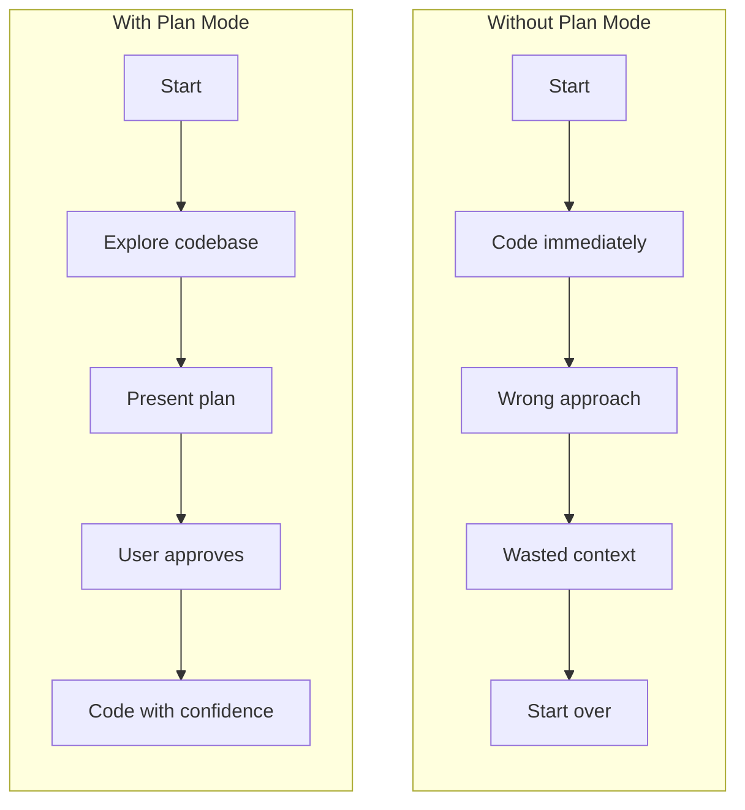

# Introduction

## What is a Coding Assistant?

A coding assistant is more than a tool that writes code. It's a system that uses a language model to tackle complex programming tasks — reading files, understanding errors, editing code, running tests — by combining text generation with real-world actions.


## How Coding Assistants Work

When you give a coding assistant a task like "fix this bug based on the error message," it follows a process similar to how a human developer works:

<!-- Diagram: The assistant architecture — Task on the left (error message), flows into the Assistant box containing Language Model + Set of Tools, with a loop of Gather Context → Formulate a Plan → Take Action → Iterate. Similar to Anthropic's diagram. -->


1. **Gather context** — understand the error, find which files are affected, read relevant code
2. **Formulate a plan** — decide how to fix it (change this function, update that import, add a test)
3. **Take action** — edit the file, run the tests, verify the fix

The first and last steps are the interesting ones. They require the assistant to interact with the real world — reading actual files from disk, running actual commands in a terminal, writing actual changes to your codebase.

## The Tool Use Challenge

Here's the fundamental challenge: language models can only process text and return text. If you ask a standalone LLM to read a file, it will tell you it can't.

So how does a coding assistant actually read files and run commands?

It uses a system called **tool use**. When you send a request, the coding assistant wraps your message with instructions that teach the model how to request actions.

<!-- Diagram: Tool use sequence diagram — Coding Assistant on the left, Language Model on the right, with arrows showing: (1) "What code is in main.go?" + tool instructions → Model, (2) Model responds "ReadFile: main.go" ←, (3) Assistant reads file, sends contents → Model, (4) Model provides final answer ←. Similar to Anthropic's sequence diagram. -->


Here's the complete flow:

1. You ask: *"What code is in main.go?"*
2. The coding assistant adds tool instructions to your message (invisible to you)
3. The model responds with a structured request: `ReadFile: main.go`
4. The assistant reads the actual file from disk and sends the contents back to the model
5. The model provides a final answer based on the real file contents

The model never touches your filesystem directly. It generates text that the assistant interprets as tool calls, executes them, and feeds the results back. This is what makes an LLM into a coding partner — the ability to reach into the real world through tools.

## Why Claude's Tool Use Matters

Not all language models use tools with the same skill level. Claude is particularly strong at:

- **Combining tools** — reading several files, cross-referencing them, then making targeted edits. When Claude needs to understand a bug, it might read the error log, grep for the function name, read the source file, and read the test file — all before making a single edit.
- **Using unfamiliar tools** — when you add new MCP servers (external tool integrations), Claude adapts to use them without special training. You plug in a Playwright server, and Claude starts automating browsers.
- **Knowing what to read** — Claude navigates codebases without needing a pre-built index. It uses glob patterns to find files, grep to search contents, and reads only what's relevant. This means your entire codebase doesn't need to be sent to a server.


### Practice: See Tool Use in Action

Open your claude terminal inside this lab and then clone the repository
```bash
cd code
git clone https://github.com/poridhioss/claude-code-best-practices-starter.git
cd claude-code-best-practices-starter
claude
```
> Choose you preferred theme.


> Yes, I trust this folder


Ask Claude:

```
> What does the README.md say about this project?
```

Watch the terminal — you'll see Claude make a **Read** tool call, receive the file contents, and then answer based on what it read. The model didn't already know what's in that file. It requested the action, the CLI executed it, and the contents came back.

<!-- Poridhi screenshot: Claude reading README.md — showing the Read tool call and response -->


Now ask something that requires multiple tools:

```
> How does the weather route handle errors? Show me the error handling flow.
```

This time Claude will use Glob (to find files), then Read (to examine the route and utility files), then cross-reference them. Multiple tools, chained together from a single prompt.

<!-- Poridhi screenshot: Claude using Glob then Read to find and examine weather.js and formatter.js -->


## Claude Code in Action

Claude Code is Anthropic's CLI-based coding assistant. It runs in your terminal, inside your project directory, and uses an agentic loop to work through tasks step by step.


## The Agentic Loop

When you give Claude Code a task, it doesn't just respond once. It enters a loop:



1. **Read** your prompt and the available context
2. **Decide** what action to take next
3. **Execute** the action using a tool (read a file, run a command, edit code)
4. **Observe** the result
5. **Repeat** until the task is complete

This is what makes Claude Code "agentic" — it autonomously decides what to do next based on what it learns at each step.

A simple request like *"fix the failing test"* might play out as:

1. Read the test file to understand what's being tested
2. Run the test to see the exact error
3. Read the source file that the test covers
4. Edit the source to fix the bug
5. Run the test again to verify
6. See a new error — a different test now fails
7. Read that test, make another edit
8. Run all tests — they pass

That's 8 tool calls from a single prompt. Claude decided each step based on the previous result. It discovered step 4 only after seeing the error at step 3. Each observation shapes the next action.

### Practice: Watch the Agentic Loop

In your Claude session, ask:

```
What does this project do? Explore the directory structure and key files.
```

Don't interrupt — let Claude work. Watch the terminal and count the tool calls. Claude will use Glob to scan directories, Read to examine files it finds interesting, maybe Grep to search for patterns. Each step is a decision based on what it learned in the previous step.

<!-- Poridhi screenshot: Claude exploring the project — showing sequential Glob/Read calls as it discovers and reads files -->


## How Claude Parallelizes Work

When Claude needs information from multiple independent sources, it doesn't read them one at a time. It batches independent operations into parallel calls.


Here's the difference in practice. When you ask vaguely, Claude has to search first, then read what it finds — that's sequential work across multiple turns. When you're specific about which files to look at, Claude reads them all simultaneously in a single turn.

You can help Claude parallelize by being specific. Instead of *"look at the code"* (Claude has to search first), try *"look at `src/routes/weather.js` and `src/utils/formatter.js`"* (Claude can read both immediately).

This isn't a minor optimization. Over a 20-step task, the difference between "Claude searches then reads" and "Claude reads directly" can save significant context and time. In a lab environment with limited tokens, this matters even more.

### Practice: See Parallelization

Now try being specific. Ask Claude about two files you know exist:

```
Read src/routes/weather.js and src/utils/formatter.js and explain how they work together.
```

Watch the terminal — you'll see Claude read both files at the same time (two Read calls with no gap between them). It knows both file paths from your prompt, so it reads them in parallel instead of one after the other.

<!-- Poridhi screenshot: Two simultaneous Read calls for weather.js and formatter.js -->


## Three Model Tiers

Claude Code supports three model tiers you can switch between depending on the task:

| Model | Input / Output Price | Best For |
|-------|---------------------|----------|
| **Haiku 4.5** | $1 / $5 per 1M tokens | Quick lookups, simple edits, formatting |
| **Sonnet 4.6** | $3 / $15 per 1M tokens | Daily coding, feature implementation, debugging |
| **Opus 4.6** | $5 / $25 per 1M tokens | Architecture decisions, complex reasoning, multi-file refactors |

> Models with extended 1M token context are also available at higher pricing — Sonnet 4.6 at $6/$22.50 and Opus 4.6 at $10/$37.50.

The practical pattern: **Sonnet 4.6** is the default and covers most daily work. Switch to **Opus 4.6** when Claude is making wrong architectural decisions or missing edge cases. Drop to **Haiku 4.5** for repetitive tasks like formatting, renaming, or generating boilerplate.

You can set the model:
- Per session: `/model` command
- At startup: `claude --model opus`

### Practice: Check Your Model

In your Claude session, type:

```
/model
```

You'll see a menu like this:


The default is Sonnet. For the Poridhi lab environment with limited tokens, stick with **minimax/minimax**.


## Plan Mode

For complex tasks, Claude Code supports a **plan mode** where it explores your codebase and designs an approach before writing any code:



1. Claude reads files, greps for patterns, maps the architecture
2. It presents a step-by-step implementation plan
3. You review and approve (or redirect)
4. Only then does Claude start writing code

This prevents the most expensive mistake in agentic coding: Claude going down the wrong path, burning context, and needing to start over. Without plan mode, Claude might start implementing a feature, realize halfway through that it chose the wrong approach, and now your context is filled with work you're about to undo. With plan mode, Claude explores first, presents its approach, and you can redirect before any code is written.

Enter plan mode by pressing **Shift+Tab** to cycle through permission modes, or start with:

```bash
claude --permission-mode plan
```

### Practice: Try Plan Mode

Press **Shift+Tab** in your Claude session to enter plan mode, then ask:

```
How would you add a new city "paris" to the weather API?
```

Watch how Claude explores the codebase — reading the route files, the coordinates utility, the tests — but doesn't write any code. It presents a plan instead. This is the explore-first approach that saves context on complex tasks.

<!-- Poridhi screenshot: Claude in plan mode — exploring files and presenting a plan without making changes -->


## Key Takeaways

- Coding assistants use language models + **tool use** to bridge text generation and real-world actions (reading files, running commands, editing code)
- Claude Code runs an **agentic loop**: decide → act → observe → repeat until the task is complete
- Being specific about file paths helps Claude **parallelize** reads and save context
- Three model tiers (**Haiku**, **Sonnet**, **Opus**) let you match capability and cost to task complexity
- **Plan mode** prevents costly wrong turns — explore first, then implement
