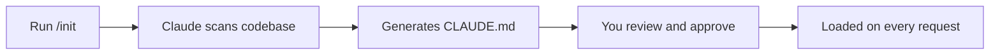
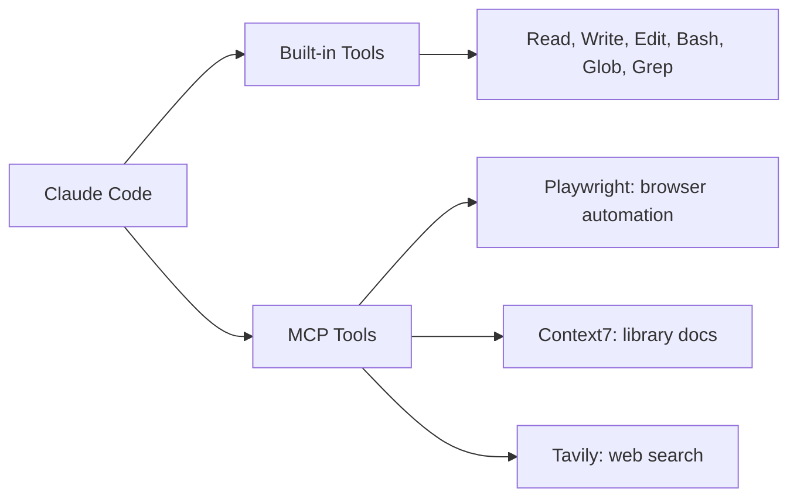

# Getting Started

## Installation

Claude Code is pre-installed in your Poridhi lab environment — just run `claude` in the terminal to get started.

> **Using your own account?** Install with `npm install -g @anthropic-ai/claude-code` and authenticate on first run. See [AWS Bedrock](https://docs.anthropic.com/en/docs/claude-code/bedrock-vertex#aws-bedrock) or [Google Vertex](https://docs.anthropic.com/en/docs/claude-code/bedrock-vertex#google-cloud-vertex-ai) for alternative providers.

---

## Project Setup

Clone the starter project and start your first Claude session:

```bash
cd code & git clone https://github.com/poridhioss/claude-code-best-practices-starter.git
cd claude-code-best-practices-starter
claude
```

The starter project is a Node.js weather API with this structure:

```
src/
├── index.js              — Server entry point and routing
├── middleware/
│   ├── logger.js         — Request logging
│   └── validator.js      — Query parameter validation
├── routes/
│   ├── weather.js        — Weather endpoint (calls Open-Meteo API)
│   └── cities.js         — City listing endpoint
└── utils/
    ├── coordinates.js    — City-to-coordinate mapping
    └── formatter.js      — Response formatting helpers
tests/
└── weather.test.js       — Unit tests
```

This is the project you'll build Claude Code configurations on top of throughout the course — CLAUDE.md, commands, hooks, skills, and agents.

### Practice: Explore the Project

Start Claude inside the project and ask:

```
What does this project do? Walk me through the code.
```

Watch Claude explore — it will Glob the directory, Read key files, and piece together how the weather API works. This is the agentic loop from Module 1 in action.

<!-- Poridhi screenshot: Claude exploring the starter project -->

---

## CLAUDE.md — Your Project's System Prompt

`CLAUDE.md` is a file in your project root that gets included in every request to Claude. It's not documentation — it's a persistent system prompt.

Right now the starter project doesn't have one. Let's create one.

### The /init Command

Run `/init` inside your Claude session:

```
/init
```

Claude analyzes your codebase — project structure, important files, coding patterns — and generates a CLAUDE.md. You approve the write, and from that point forward, Claude has persistent project context.



A practical tip: keep CLAUDE.md under 150 lines. It's loaded into every single request, so bloated files waste context on every turn.

### @ File Mentions

When you need Claude to look at a specific file, use `@`:

```
How does error handling work? @src/routes/weather.js
```

This injects the file contents directly into your message. Claude doesn't need to spend tool calls finding the file — the contents are already there.

### # Memory Mode

Type `#` followed by an instruction to save it to your CLAUDE.md:

```
# Always run tests after making changes
# Use descriptive variable names
```

Claude merges these into your CLAUDE.md. This is how you build up project instructions over time.

### Three CLAUDE.md Locations

| File | Scope | Shared |
|------|-------|--------|
| `CLAUDE.md` | This project | Yes (git tracked) |
| `CLAUDE.local.md` | This project | No (git-ignored) |
| `~/.claude/CLAUDE.md` | All projects | No |

### Practice: Create Your CLAUDE.md

1. In your Claude session, run `/init`
2. Review the generated CLAUDE.md — approve it
3. Try memory mode: type `# Always run npm test before committing`
4. Check the file — your instruction should be merged in

<!-- Poridhi screenshot: /init generating CLAUDE.md -->

---

## Controlling Context

Context is the real constraint in agentic coding. When Claude's context window fills up, it forgets earlier work, repeats itself, and loses the thread.

### Checking Context Usage

```
/context
```

You'll see something like:

```
Context window usage:
  ██████████████░░░░░░░░░░░░░░░░ 47%

  System prompt:     8,234 tokens
  Conversation:     82,156 tokens
  ─────────────────────────────
  Total:            90,390 / 192,000 tokens
```

At 47% Claude works well. At 80% you'll start noticing problems — re-reading files, forgetting earlier decisions.

### Compacting

When context gets large, `/compact` summarizes the conversation while preserving key information:

```
/compact
```

You can also give it focus:

```
/compact focus on the weather route changes
```

**When to compact:** Around 50% usage. Don't wait until it's full — by then Claude has already been degrading.

**Signs you need to compact:**
- Claude re-reads a file it already read
- Claude asks a question you already answered
- Responses become more generic, less grounded in the code
- Claude starts ignoring CLAUDE.md instructions

### Auto-Compact

Set an automatic threshold:

```bash
CLAUDE_AUTOCOMPACT_PCT_OVERRIDE=50 claude
```

Or in `.claude/settings.json`:
```json
{
  "env": {
    "CLAUDE_AUTOCOMPACT_PCT_OVERRIDE": "80"
  }
}
```

### Session Hygiene

- **New sessions for unrelated work.** Finished a feature? Start fresh with `claude` for the next task.
- **Be specific.** *"Fix the bug in src/routes/weather.js line 23"* beats *"fix the bug"*.
- **Use @ mentions.** *"Refactor @src/utils/formatter.js"* skips the search step.
- **Break big tasks into sessions.** Plan in one, implement in another, test in a third.

### Practice: Manage Your Context

1. Ask several questions about the project to build up context
2. Run `/context` — note the usage percentage
3. Run `/compact` then `/context` again — see the difference
4. Start a fresh session with `claude` — notice the clean context

<!-- Poridhi screenshot: /context showing usage, then after /compact -->

---

## Custom Commands

Commands are prompt templates you invoke with a slash. Instead of typing the same instructions each time, you save them as markdown files.

### Creating a Command

Commands live in `.claude/commands/`. Create your first one:

`.claude/commands/summarize-diff.md`:
```yaml
---
description: Summarize the current git diff
model: haiku
---

Summarize the staged changes in a concise paragraph.
```

Invoke with `/summarize-diff`.

Notice `model: haiku` — summarizing a diff doesn't need deep reasoning, so use the fastest model.

### Frontmatter Fields

| Field | What It Does |
|-------|-------------|
| `description` | Shown in autocomplete when you type `/` |
| `argument-hint` | Shows what arguments to pass |
| `allowed-tools` | Tools that skip permission prompts |
| `model` | Which model runs this command |

### Arguments with $ARGUMENTS

Commands accept arguments using `$ARGUMENTS` (all args) or `$0`, `$1` (positional):

```yaml
---
description: Explain a specific file
argument-hint: [file-path]
---

Explain what $0 does and how it fits into the project.
```

Invoke: `/explain src/routes/weather.js`

### Dynamic Context with !backtick

The `!`backtick syntax runs a shell command and injects the output before Claude sees the prompt:

```markdown
Here are the current staged changes:

!`git diff --staged`

Summarize these changes for a commit message.
```

When Claude processes this, the backtick output is already replaced with the actual diff. Claude gets the real data without spending a tool call.

You can combine arguments and backticks:

```markdown
Here is the test output:
!`npm test 2>&1`

Here is the failing file:
!`cat $0`

Fix the failing test.
```

### Practice: Create a Command

1. Create `.claude/commands/` directory in the starter project
2. Create `.claude/commands/test-and-fix.md`:
   ```yaml
   ---
   description: Run tests and fix any failures
   model: sonnet
   ---

   Run the tests for this project:
   !`npm test 2>&1`

   If any tests fail, fix them.
   ```
3. Run `/test-and-fix` in Claude — watch the backtick output get injected

<!-- Poridhi screenshot: Creating and running a custom command -->

---

## MCP Servers

MCP (Model Context Protocol) servers extend Claude with external tools. Without MCP, Claude can read files, edit code, and run shell commands. MCP adds capabilities like browser automation, library docs lookup, and web search.

### How MCP Works

Each MCP server provides tools that Claude can use just like its built-in ones. When you add Playwright, Claude gains `browser_navigate`, `browser_click`, `browser_snapshot`, and more.



### Configuring MCP Servers

Create `.mcp.json` at your project root:

```json
{
  "mcpServers": {
    "playwright": {
      "command": "npx",
      "args": ["-y", "@playwright/mcp"]
    },
    "context7": {
      "command": "npx",
      "args": ["-y", "@upstash/context7-mcp"]
    }
  }
}
```

Two transport types:
- **stdio**: spawns a local process via `npx` (most common)
- **http**: connects to a remote URL

### Auto-Approving MCP Servers

By default, Claude asks permission before using MCP tools. For trusted servers, auto-approve in `.claude/settings.json`:

```json
{
  "enableAllProjectMcpServers": true
}
```

Or approve specific ones:
```json
{
  "enabledMcpjsonServers": ["context7", "playwright"]
}
```

### How Claude Adapts to New Tools

Claude doesn't need training on new MCP tools. Each server provides a description of what its tools do and what parameters they accept. Claude reads these and figures out how to use them.

Add Playwright, then ask *"test the login page at localhost:3000"* — Claude navigates, fills forms, clicks buttons, and takes screenshots. No examples needed.

### Practice: Add an MCP Server

1. Create `.mcp.json` in the starter project root:
   ```json
   {
     "mcpServers": {
       "context7": {
         "command": "npx",
         "args": ["-y", "@upstash/context7-mcp"]
       }
     }
   }
   ```
2. Restart Claude (exit and run `claude` again)
3. Ask: *"Use Context7 to look up the Node.js http module documentation"*
4. Watch Claude use the MCP tool — it appears as `mcp__context7__query-docs`

<!-- Poridhi screenshot: Claude using an MCP tool -->

---

## GitHub Integration

Claude uses the `gh` CLI for all GitHub operations. No plugins needed — if `gh` is installed and authenticated, Claude can create PRs, review code, and work through issues.

### Prerequisites

```bash
gh auth status    # Check if logged in
gh auth login     # Authenticate if needed
```

### Creating Pull Requests

After making changes, ask Claude:

```
Create a pull request for these changes
```

Claude follows a specific protocol:

1. Runs `git status`, `git diff`, `git log` in parallel to understand the changes
2. Drafts a PR title and description
3. Commits, pushes, and creates the PR with `gh pr create`

### Reviewing Pull Requests

```
Review PR #42
```

Claude fetches the diff with `gh pr view`, reads the changed files, and provides feedback — bugs, style issues, missing edge cases.

### Working with Issues

```
Look at issue #15 and fix it
```

Claude reads the issue with `gh issue view`, explores the relevant code, implements a fix, and can create a PR for it.

### Controlling Permissions

Control what Claude can do without asking in `.claude/settings.json`:

```json
{
  "permissions": {
    "allow": ["Bash(gh pr view *)", "Bash(gh issue view *)"],
    "ask": ["Bash(gh pr create *)", "Bash(git push *)"]
  }
}
```

This lets Claude read PRs and issues freely, but asks before creating PRs or pushing code.

### Practice: GitHub Workflow

1. Verify `gh` is installed: `gh --version`
2. Make a small change to the starter project (add a comment to any file)
3. Ask Claude: *"Create a commit for this change"*
4. Ask Claude: *"Show me the recent commits"*

<!-- Poridhi screenshot: Claude creating a commit via gh -->

---

## Key Takeaways

- Install with `npm install -g @anthropic-ai/claude-code`, authenticate on first run
- CLAUDE.md is a persistent system prompt — generate with `/init`, keep under 150 lines
- Context is the real constraint — use `/compact` at ~50%, start new sessions for unrelated work
- Commands save repeatable prompts — `$ARGUMENTS` for input, `!`backtick for live shell output
- MCP servers extend Claude with external tools — configure in `.mcp.json`
- GitHub integration works through `gh` CLI — control permissions in settings.json
