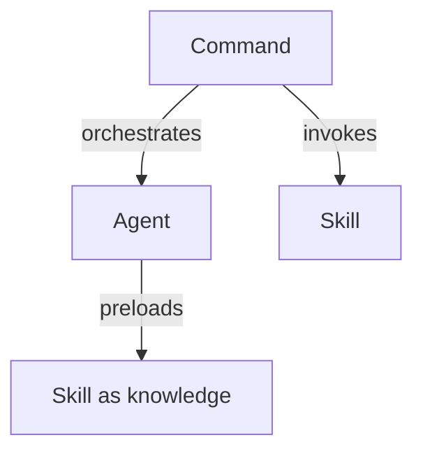
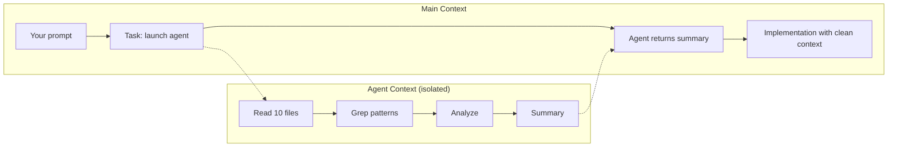

# Agents & Skills

## What are Skills?

Skills are reusable instruction sets that Claude loads on demand. Unlike CLAUDE.md (loaded on every request), skills only enter context when invoked — keeping your context window clean.

### When You Need a Skill

The signal is repetition. If you've given Claude the same instructions three times — "call this API, parse this field, return this format" — that's a skill waiting to be extracted.

| | CLAUDE.md | Skills |
|---|-----------|--------|
| **Loaded** | Every request | On demand |
| **Purpose** | Project context | Task-specific instructions |
| **Impact on context** | Every turn | Only when active |
| **Best for** | Architecture, conventions | API calls, specific workflows |

### Two Skill Patterns

**Invocable skills** — you call them directly with `/skill-name` or via the Skill tool.

**Agent skills** — preloaded into an agent's context as domain knowledge via the `skills:` field. The agent doesn't "call" the skill — it *knows* the instructions.

### Skills Live in .claude/skills/

Every skill is a `SKILL.md` file inside a named directory:

```
.claude/skills/
├── my-skill/
│   └── SKILL.md
└── another-skill/
    └── SKILL.md
```

### Practice: Explore Skills

In your Claude session, type `/` and look for any skills in the autocomplete list. If you created the `project-health` skill in a previous exercise, it should appear here.

<!-- Poridhi screenshot: Skill appearing in autocomplete -->

---

## Creating Your First Skill

Let's build a skill from scratch for the starter project.

### A Weather Check Skill

Create `.claude/skills/check-weather-api/SKILL.md` in the starter project:

```yaml
---
name: check-weather-api
description: Test the weather API endpoints and report their status
---

## Task

Test the weather API and report the status of each endpoint.

## Instructions

1. **Start the server** if not running:
   - Run `npm run dev` in the background

2. **Test each endpoint**:
   - `GET http://localhost:3000/` — should return `{"status": "ok"}`
   - `GET http://localhost:3000/cities` — should return the list of supported cities
   - `GET http://localhost:3000/weather/dubai` — should return weather data for Dubai

3. **Report results** in this format:

## Expected Output

```
Health Check:
  / (root)        → [pass/fail]
  /cities         → [pass/fail]
  /weather/dubai  → [pass/fail]
```

## Boundaries

- Only test endpoints, do not modify any code
- Stop the server after testing if you started it
```

### Why Each Choice Matters

**Specific endpoints** — not "test the API" but exact URLs with expected responses. Claude follows these mechanically.

**Expected output format** — a contract. Whoever calls this skill knows what format to expect.

**Boundaries** — "do not modify any code" prevents Claude from helpfully fixing bugs it finds while testing.

### Practice: Build and Run the Skill

1. Create the `.claude/skills/check-weather-api/` directory
2. Create `SKILL.md` with the content above
3. Restart Claude and run `/check-weather-api`
4. Watch Claude start the server, test each endpoint, and report results

<!-- Poridhi screenshot: Skill running and testing endpoints -->

---

## Configuration & Multi-file Skills

Skills support frontmatter fields that control execution.

### Frontmatter Fields

| Field | What It Does |
|-------|-------------|
| `name` | Display name and `/slash-command` |
| `description` | Shown in autocomplete, used for auto-discovery |
| `argument-hint` | Autocomplete hint (e.g., `[city-name]`) |
| `user-invocable` | `false` to hide from `/` menu (agent-only) |
| `disable-model-invocation` | `true` to prevent auto-invocation |
| `allowed-tools` | Tools that skip permission prompts |
| `model` | Model to use when active |
| `context` | `fork` for isolated execution |
| `hooks` | Lifecycle hooks scoped to this skill |

### Tool Restrictions

Pre-approve tools so Claude doesn't prompt during the skill:

```yaml
---
name: code-formatter
allowed-tools: Read, Edit, Bash(npx prettier *)
---
```

### Forked Context

`context: fork` runs the skill in an isolated sub-agent — heavy work stays out of your main context:

```yaml
---
name: codebase-analysis
context: fork
agent: general-purpose
---
```

### Dynamic Content

Skills support the same substitutions as commands:

- `$ARGUMENTS` — all arguments passed
- `$0`, `$1` — positional arguments
- `` !`command` `` — shell output injected at load time

### Practice: Add Frontmatter

Update your `check-weather-api` skill with `allowed-tools`:

```yaml
---
name: check-weather-api
description: Test the weather API endpoints and report their status
allowed-tools: Bash(curl *), Bash(npm run *)
---
```

Now Claude can run curl and npm without prompting during this skill.

<!-- Poridhi screenshot: Skill running without permission prompts -->

---

## Skills vs. Other Features

Claude Code has three abstractions for reusable work. They compose together.

### The Three Primitives



**Commands** (`.claude/commands/`) — Prompt templates. Orchestrate workflows. Handle user interaction.

**Skills** (`.claude/skills/`) — Reusable instructions. Loaded on demand. Encode domain knowledge.

**Agents** (`.claude/agents/`) — Isolated workers. Own context, own tools, own model.

### The Decision Framework

| Situation | Reach For |
|-----------|-----------|
| Same prompt, different arguments | **Command** |
| Same instructions, multiple contexts | **Skill** |
| Heavy work that would burn main context | **Agent** |
| Need to restrict tools | **Agent** |
| Domain knowledge for an agent | **Skill** (preloaded) |

### How They Compose

```
/weather-orchestrator (Command)
  ├── Step 1: Ask user → Celsius or Fahrenheit?
  ├── Step 2: Task → weather-agent (Agent)
  │     └── Preloaded: weather-fetcher (Skill)
  │         → Fetches from Open-Meteo API
  └── Step 3: Skill → weather-svg-creator (Skill)
        → Creates SVG card from temperature data
```

The command orchestrates. The agent isolates API work. The skills encode domain knowledge.

### Practice: Think Through the Architecture

Consider your starter project. If you wanted to build a system that:
1. Asks the user for a city
2. Fetches weather for that city
3. Formats the result as a markdown report

Which would be a command? Which would be a skill? Would you need an agent?

<!-- Poridhi screenshot: Student's architecture decision -->

---

## Sharing Skills & Troubleshooting

### How Discovery Works

Claude Code scans for `SKILL.md` files in:

1. **Project**: `.claude/skills/<name>/SKILL.md`
2. **Ancestor directories**: walking up to filesystem root
3. **User-level**: `~/.claude/skills/<name>/SKILL.md`

In a monorepo, parent skills are available to all subdirectories.

### Troubleshooting Checklist

**Skill doesn't appear in `/` menu:**
- File named exactly `SKILL.md`? (case-sensitive)
- In `.claude/skills/<name>/SKILL.md`? (needs subdirectory)
- `user-invocable` set to `false`? (intentionally hidden)

**Skill loads but doesn't work well:**
- Instructions specific enough? Exact URLs, exact fields?
- Has access to needed tools? Check `allowed-tools`

**Check what's available:**
```
/skills
```

### Practice: Verify Your Skills

Run `/skills` in Claude and check that your `check-weather-api` skill appears with its description.

<!-- Poridhi screenshot: /skills listing -->

---

## Sub-agents & Orchestration

Sub-agents are isolated workers with their own context window, tools, and model.

### Why Sub-agents Exist

The practical reason: **protecting your main context**.

Without a sub-agent, asking Claude to research something reads many files, greps patterns, generates explanations — all of that fills your main context. When you follow up with implementation, you have less context available.

With a sub-agent, the research happens in a separate context. Only the summary returns to your main session.



### Anatomy of an Agent

Agents are defined in `.claude/agents/<name>.md` with YAML frontmatter:

```yaml
---
name: code-reviewer
description: Reviews code changes for bugs and style issues
tools: Read, Grep, Glob
model: sonnet
maxTurns: 10
permissionMode: plan
---

Review the code changes and provide feedback on:
1. Potential bugs
2. Style issues
3. Missing edge cases
```

Key fields:

| Field | What It Does |
|-------|-------------|
| `tools` | Allowlist of tools (restricts what the agent can do) |
| `model` | Model tier for this agent |
| `maxTurns` | Cap on agentic loop iterations |
| `skills` | Skills preloaded into context |
| `memory` | Persistent memory: `user`, `project`, or `local` |
| `permissionMode` | Safety level |

### Invoking Agents

Always use the Task tool, never bash:

```
Task(
  subagent_type="code-reviewer",
  description="Review recent changes",
  prompt="Review the changes in the last commit for bugs."
)
```

### Practice: Create a Review Agent

1. Create `.claude/agents/code-reviewer.md` in the starter project:
   ```yaml
   ---
   name: code-reviewer
   description: Reviews code for bugs and improvements
   tools: Read, Grep, Glob
   model: sonnet
   maxTurns: 10
   ---

   Review the specified code and provide feedback on:
   1. Potential bugs or errors
   2. Code style issues
   3. Missing error handling
   4. Suggestions for improvement
   ```

2. Ask Claude: *"Use the code-reviewer agent to review src/routes/weather.js"*
3. Watch the agent work in its own context — reading the file, analyzing patterns, returning a summary

<!-- Poridhi screenshot: Agent running and returning review -->

### The Full Pattern: Command → Agent → Skill

The most powerful architecture composes all three:

1. **Command** — entry point, handles user interaction, orchestrates steps
2. **Agent** — isolated worker, does heavy lifting in its own context
3. **Skill** — domain knowledge, preloaded into the agent or invoked separately

Data flows through conversation context. No shared state, no files — the agent returns data, the next step reads it from context.

---

## Key Takeaways

- Skills are on-demand instructions — create one when you've given the same instructions three times
- Two patterns: invocable (user calls it) and agent skills (preloaded as knowledge)
- Good skills are precise: exact URLs, exact fields, exact output format, clear boundaries
- Commands orchestrate, skills instruct, agents isolate — they compose together
- Sub-agents protect your main context from heavy research work
- Always invoke agents via the Task tool, never bash
- The Command → Agent → Skill pattern is the most powerful orchestration architecture
