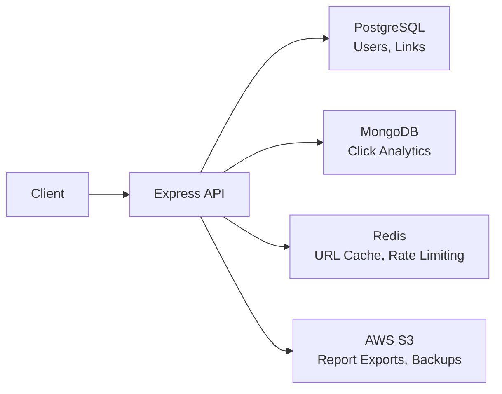
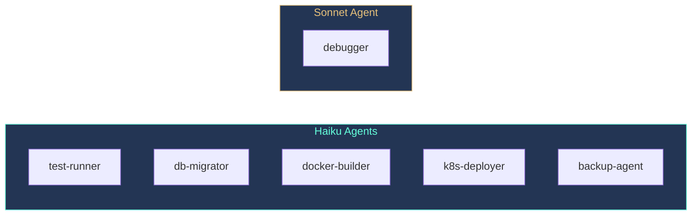
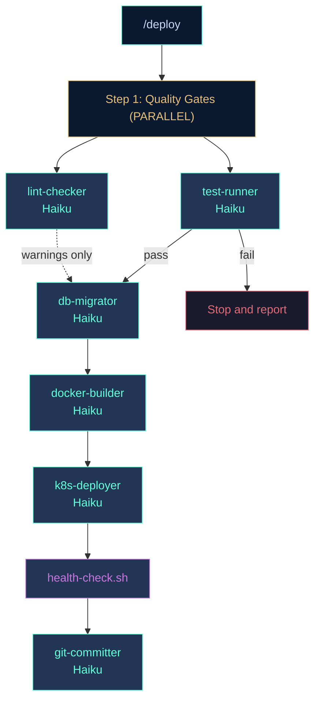
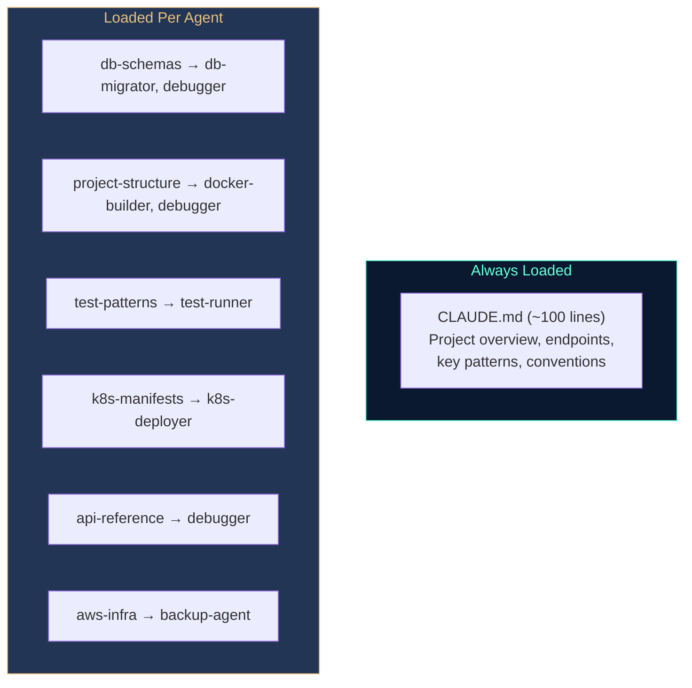

# The Real Project — Skills, Agents & Orchestration in Practice

## The URL Shortener Project

Modules 1-4 used a simple weather API to learn fundamentals. Now you'll operate a full-stack application using everything you've learned — skills, agents, and commands working together.

The URL Shortener is a pre-built Node.js application with three databases, S3 integration, Docker, and Kubernetes manifests. You won't write the code — it's already written. You'll use Claude Code to **deploy, test, debug, and operate** it.

### Clone and Setup

```bash
git clone https://github.com/poridhioss/claude-code-best-practices-url-shortner-project.git
cd claude-code-best-practices-url-shortner-project
```

Start the databases and verify:

```bash
cd docker && docker compose up -d postgres mongodb redis && cd ..
npm install
npm run migrate
npm run seed
npm run dev
```

Check that everything is connected:

```bash
curl http://localhost:3000/health
```

Expected response:
```json
{"status":"ok","services":{"postgres":"connected","mongo":"connected","redis":"connected"}}
```

### Project Architecture



| Database | What It Stores | Why This Database |
|----------|---------------|-------------------|
| **PostgreSQL** | Users, Links (relational) | Foreign keys, transactions |
| **MongoDB** | Click events (high-volume) | Flexible schema, fast writes |
| **Redis** | URL cache, rate counters | Sub-millisecond lookups, TTL |
| **S3** | CSV reports, DB backups | Cheap, durable object storage |

### Practice: Explore the Project

1. Start Claude inside the project: `claude`
2. Ask: *"What does this project do? Walk me through the architecture."*
3. Notice how Claude reads `CLAUDE.md` first — it already knows the file structure, endpoints, and database schemas without exploring
4. Compare: start a fresh session, temporarily rename CLAUDE.md, and ask the same question — watch how many more file reads Claude needs

<!-- Poridhi screenshot: Claude reading CLAUDE.md and answering with full project knowledge -->

---

## Skills as Preloaded Knowledge

In Module 4, you built invocable skills — user-facing tasks triggered with `/skill-name`. This project uses a different pattern: **agent skills**. These are non-invocable knowledge files preloaded into agents.

### The Problem

Without skills, the `db-migrator` agent would start every invocation like this:

```
Agent: "I need to understand the database schema"
→ Reads migrations/001_create_users.sql             (~800 tokens)
→ Reads migrations/002_create_links.sql             (~800 tokens)
→ Reads src/models/Click.js                         (~600 tokens)
→ "Now I understand. Let me run migrations."
```

That's ~2,200 tokens of exploration that happens identically every time. With the `db-schemas` skill preloaded, the agent already knows every table, collection, and key pattern before it starts.

### Agent Skills vs Invocable Skills

| | Invocable Skill | Agent Skill |
|---|----------------|-------------|
| **Triggered by** | User types `/skill-name` | Preloaded via agent `skills:` field |
| **`user-invocable`** | `true` (default) | `false` |
| **Purpose** | Execute a task | Provide background knowledge |
| **Example** | `/check-weather-api` | `db-schemas` preloaded into `db-migrator` |

### The Six Skills in This Project

All six are non-invocable (`user-invocable: false`). They exist purely to feed knowledge into agents:

```
.claude/skills/
├── project-structure/SKILL.md   — File layout, request flow, conventions
├── db-schemas/SKILL.md          — Tables, collections, Redis keys, S3 paths
├── api-reference/SKILL.md       — Every endpoint with curl examples
├── k8s-manifests/SKILL.md       — Manifest descriptions, apply order
├── aws-infra/SKILL.md           — EC2 setup, S3 bucket structure, IAM
└── test-patterns/SKILL.md       — Test framework, mocking approach
```

Each skill is 40-80 lines of focused knowledge. Not documentation for humans — **context for agents**.

### Inside a Skill

Open `.claude/skills/db-schemas/SKILL.md`:

```yaml
---
name: db-schemas
description: All database schemas, collections, and key patterns for the URL Shortener
user-invocable: false
---

# Database Schemas

## PostgreSQL

### users table
CREATE TABLE users (
  id SERIAL PRIMARY KEY,
  email VARCHAR(255) UNIQUE NOT NULL,
  password_hash VARCHAR(255) NOT NULL,
  created_at TIMESTAMP DEFAULT NOW()
);
...
```

The frontmatter marks it as non-invocable. The body contains exactly what an agent needs to work with the database — no more, no less.

### Practice: Read the Skills

1. Open each skill file in `.claude/skills/` — read through them
2. Ask Claude: *"What skills are available in this project?"*
3. Notice they don't appear in the `/` autocomplete menu — they're agent-only
4. Open `.claude/agents/db-migrator.md` — find the `skills:` field that preloads `db-schemas`

<!-- Poridhi screenshot: Agent frontmatter showing skills field -->

---

## Agents — Specialized Workers with Constraints

Agents are isolated sub-processes with their own context window, tools, and model. This project starts with six agents — five mechanical (Haiku) and one reasoning (Sonnet). You'll add two more later in this module.

### Why Isolation Matters

When you run tests manually, the full output enters your main context. A 50-line test output stays there permanently:

```
Main context: 45K tokens
  → Run npm test                                    (+3K tokens)
  → Read failing test file                          (+1.5K tokens)
  → Read source file                                (+2K tokens)
Main context: 51.5K tokens (all results stay)
```

With an agent, the work happens in a separate context:

```
Main context: 45K tokens
  → Launch test-runner agent (isolated)
    Agent reads, runs tests, analyzes           (8.5K in agent context)
    Returns: "9 tests passed"                   (200 tokens)
Main context: 45.2K tokens (only the summary stays)
```

The agent burned 8.5K tokens internally, but your main session grew by only 200.

### Anatomy of an Agent

Open `.claude/agents/test-runner.md`:

```yaml
---
name: test-runner
description: Runs unit and integration tests for the URL Shortener
tools: Bash, Read
model: haiku
maxTurns: 8
skills:
  - test-patterns
---

You are a test runner agent. Your job is to run tests and report results.
...
```

Every field constrains the agent:

| Field | Value | Why |
|-------|-------|-----|
| `tools` | `Bash, Read` | Can run commands and read files — cannot edit, search, or spawn sub-agents |
| `model` | `haiku` | Running tests is mechanical — no reasoning needed |
| `maxTurns` | `8` | Caps token burn if something goes wrong |
| `skills` | `test-patterns` | Preloads test file locations and run commands |

### The Six Agents



| Agent | Model | Tools | Skills | Job |
|-------|-------|-------|--------|-----|
| `test-runner` | haiku | Bash, Read | test-patterns | Run tests, report results |
| `db-migrator` | haiku | Bash, Read | db-schemas | Run SQL migrations |
| `docker-builder` | haiku | Bash, Read | project-structure | Build Docker images |
| `k8s-deployer` | haiku | Bash, Read | k8s-manifests | Apply K8s manifests, verify pods |
| `backup-agent` | haiku | Bash, Read | db-schemas | Dump PostgreSQL, upload to S3 |
| `debugger` | sonnet | Bash, Read, Grep, Glob | project-structure, db-schemas, api-reference | Diagnose issues, find root causes |

Five agents use **Haiku** because their job is mechanical — run this command, check the output, report the result. The **debugger** uses Sonnet because it needs to reason about code, correlate errors with source files, and identify root causes.

### Practice: Invoke an Agent

1. In your Claude session, ask: *"Use the test-runner agent to run all tests"*
2. Watch the agent work in isolation — it runs tests and returns a summary
3. Run `/context` — notice how little context the agent consumed in your main session
4. Now ask Claude directly: *"Run npm test and tell me the results"* (without an agent)
5. Run `/context` again — compare the context cost

<!-- Poridhi screenshot: Agent running tests in isolation vs manual test run -->

---

## Commands — Orchestrating Agent Pipelines

Commands tie everything together. In Module 2 you created simple commands with `$ARGUMENTS` and `!`backtick. This project's commands orchestrate multi-agent pipelines.

### The Commands

| Command | What It Does | Agents Used |
|---------|-------------|-------------|
| `/deploy` | Full pipeline: test → migrate → build → deploy → health | test-runner + lint-checker (parallel) → db-migrator → docker-builder → k8s-deployer → git-committer |
| `/health-check` | Check all service status | None (direct bash) |
| `/fix-issue [desc]` | Diagnose → fix → verify | debugger (Sonnet) → test-runner |
| `/backup` | Dump PostgreSQL → upload to S3 | backup-agent |
| `/export-analytics [code]` | Export clicks to S3 as CSV | None (direct curl) |
| `/review-pr [number]` | Review PR for bugs, security, quality | pr-reviewer (Sonnet) |
| `/commit [desc]` | Stage changes and create commit | git-committer |

Not everything needs an agent. `/health-check` runs a bash script directly. `/export-analytics` runs curl commands. Agents are for multi-step tasks or tasks requiring reasoning.

### The /deploy Pipeline



Notice **Step 1** launches two agents in parallel — `test-runner` and `lint-checker` run concurrently. Tests are blocking (fail = stop pipeline), lint warnings are non-blocking. You'll build this parallel pattern later in this module.

Open `.claude/commands/deploy.md`. The command instructs Claude to launch agents via the Task tool — parallel where possible, sequential where dependencies exist. If tests fail, the pipeline stops.

### The /fix-issue Pipeline

This is where the architecture shines. When you type `/fix-issue "redirect returns 500"`:

1. The **debugger** (Sonnet) starts with three skills preloaded — it already knows the project structure, database schemas, and all API endpoints
2. It reads the relevant source files, checks logs, identifies the root cause
3. The command applies the fix
4. The **test-runner** (Haiku) verifies the fix passes tests

Two agents, two models, five skills, one command.

### Practice: Run the Deploy Pipeline

1. Make sure the project is running (`curl localhost:3000/health`)
2. In your Claude session, run `/deploy`
3. Watch each agent execute sequentially — test → migrate → build → deploy → health
4. After it completes, run `/context` — note how little main context was used

<!-- Poridhi screenshot: /deploy pipeline running through agents -->

---

## Token Efficiency — Why This Architecture Matters

The three layers compound to save significant tokens:

### Without Skills, Agents, and Commands

Student types: *"Run the tests, then deploy to kubernetes"*

```
Claude explores project structure                   ~3K tokens
Claude reads test files, runs tests                 ~4K tokens
Claude reads K8s manifests                          ~5K tokens
Claude applies manifests, checks pods               ~3.5K tokens
Claude summarizes                                   ~500 tokens
────────────────────────────────────────────────
Main context cost: ~16K tokens
```

### With Skills, Agents, and Commands

Student types: `/deploy`

```
Command loaded                                      ~800 tokens
→ test-runner result: "9 tests passed"              ~200 tokens
→ db-migrator result: "2 migrations complete"       ~150 tokens
→ docker-builder result: "Image built, 145MB"       ~150 tokens
→ k8s-deployer result: "5 pods running"             ~200 tokens
→ Health check output                               ~300 tokens
Summary                                             ~500 tokens
────────────────────────────────────────────────
Main context cost: ~2.3K tokens
```

Each layer contributes:
- **Skills** eliminate repeated file reads (~2K saved per agent invocation)
- **Agents** isolate context (~13K kept out of main window)
- **Commands** eliminate prompt engineering (~1K saved per invocation)

### The CLAUDE.md + Skills Split

The project splits knowledge between CLAUDE.md (always loaded, ~100 lines) and skills (loaded per agent, ~350 lines combined):



This is **progressive disclosure for AI context** — the same principle as lazy-loading CLAUDE.md in monorepos (Module 2), applied at the agent level.

### Practice: Measure the Difference

1. Run `/context` at the start of a fresh session
2. Run `/deploy` and let it complete
3. Run `/context` — note the total usage
4. Start a fresh session
5. Type manually: *"Run all tests, then build a Docker image, then deploy to Kubernetes"*
6. Run `/context` — compare the usage

<!-- Poridhi screenshot: Context comparison between /deploy and manual approach -->

---

## Building Your Own Skill + Agent

Now apply the pattern. Create a `lint-checker` agent with its own skill.

### Step 1: Create the Skill

Create `.claude/skills/lint-rules/SKILL.md`:

```yaml
---
name: lint-rules
description: Code quality rules and patterns for the URL Shortener
user-invocable: false
---

# Lint Rules

- All async route handlers must have try/catch with next(err)
- Services return data or throw errors, never send HTTP responses
- Config values come from src/config/env.js, never process.env directly
- Use const for all variables unless reassignment is needed
```

### Step 2: Create the Agent

Create `.claude/agents/lint-checker.md`:

```yaml
---
name: lint-checker
description: Checks code quality against project conventions
tools: Bash, Read, Grep
model: haiku
maxTurns: 8
skills:
  - lint-rules
  - project-structure
---

Check the source code in src/ for violations of the lint rules.
Report each violation with file:line and the rule it breaks.
Do NOT fix anything — only report.
```

### Step 3: Test It

Ask Claude: *"Use the lint-checker agent to check the routes directory"*

The agent starts with both skills preloaded — it knows the lint rules and the project structure without reading any files first.

### Step 4: Wire It Into /deploy

Open `.claude/commands/deploy.md` and add a "Step 0" before testing — run the lint-checker agent first. If issues are found, report them but continue (non-blocking).

### Practice: Build and Test

1. Create the skill and agent files above
2. Ask Claude to use the lint-checker agent
3. Does it find any violations? Does it follow the rules from your skill?
4. Add the lint step to `/deploy` and run the full pipeline

<!-- Poridhi screenshot: Custom lint-checker agent running with preloaded skills -->

---

## Debugging with Agents

The `/fix-issue` command demonstrates how agents handle reasoning tasks.

### Introduce a Bug

Open `src/services/linkService.js` and change `is_active = true` to `is_active = false` in the `resolveLink` function:

```javascript
// Change this line:
'SELECT original_url FROM links WHERE short_code = $1 AND is_active = true'
// To this:
'SELECT original_url FROM links WHERE short_code = $1 AND is_active = false'
```

### Run the Diagnostic Pipeline

```
/fix-issue "redirect endpoint returns 404 for valid short codes"
```

Watch the debugger agent (Sonnet) work:

1. It already knows every endpoint (from `api-reference` skill) and every table (from `db-schemas` skill)
2. It reads the redirect route and link service
3. It identifies `is_active = false` as the root cause
4. The command applies the fix
5. The test-runner (Haiku) verifies tests pass

### Practice: Debug with /fix-issue

1. Make the change above to introduce the bug
2. Run `/fix-issue "redirect endpoint returns 404 for valid short codes"`
3. Watch the debugger identify the root cause
4. Let the fix be applied and tests verify it
5. If the agent doesn't auto-fix, revert manually: `git checkout src/services/linkService.js`

<!-- Poridhi screenshot: debugger agent identifying the is_active bug -->

---

## Parallel Agent Execution

So far, every agent in `/deploy` runs one after another. But Step 1 — running tests and checking lint — has no dependency between the two tasks. They can run at the same time.

### How Parallel Agents Work

When a command launches multiple Task calls **in the same response**, Claude executes them concurrently. The key phrase in the command file is:

```
Launch the test-runner and lint-checker agents **in parallel** using two Task calls in the same response.
```

Claude sees this instruction and emits both Task calls simultaneously instead of waiting for the first to finish.

### Modify /deploy for Parallel Execution

Open `.claude/commands/deploy.md`. The current Step 1 runs tests first, then lint. Change it to run both concurrently.

Replace the sequential Step 1 with:

```markdown
## Step 1: Quality Gates (PARALLEL)
Launch the test-runner and lint-checker agents **in parallel** using two Task calls in the same response. These are independent checks — neither depends on the other.

If tests fail, stop and report which tests failed. Lint warnings are non-blocking — report them but continue.
```

The instruction tells Claude these are independent. Claude will launch both agents simultaneously, wait for both results, then decide whether to proceed based on the test results.

### Sequential vs Parallel — When to Use Which

| Pattern | Use When | Example |
|---------|----------|---------|
| **Sequential** | Step B needs Step A's output | migrate → build (build uses migrated schema) |
| **Parallel** | Steps are independent | test + lint (neither depends on the other) |

### Practice: Run Parallel Agents

1. Update `.claude/commands/deploy.md` with the parallel Step 1 above
2. Run `/deploy`
3. Watch the output — test-runner and lint-checker should start at the same time
4. Both results appear before Step 2 (migrations) begins
5. Check `/context` — parallel execution doesn't cost more tokens, it just runs faster

<!-- Poridhi screenshot: /deploy showing test-runner and lint-checker running in parallel -->

---

## Build a PR Review Agent

Code review is a reasoning task — the agent needs to understand the project, read the diff, and identify problems. This makes it a Sonnet agent with multiple skills.

### Step 1: Create the Agent

Create `.claude/agents/pr-reviewer.md`:

```yaml
---
name: pr-reviewer
description: Reviews pull requests for bugs, security issues, and code quality
tools: Bash, Read, Grep, Glob
model: sonnet
maxTurns: 10
skills:
  - project-structure
  - api-reference
  - db-schemas
---

You are a code review agent. Review the pull request for merge readiness.

## What To Check
1. **Security** — SQL injection, XSS, missing auth checks, exposed secrets
2. **Bugs** — Logic errors, missing error handling, race conditions
3. **Performance** — N+1 queries, missing indexes, unbounded queries
4. **Tests** — New code has test coverage, existing tests still pass

## How To Review
1. Get the PR diff: `gh pr diff <number>` or `git diff main...HEAD`
2. Read each changed file to understand the full context (not just the diff)
3. Check that tests exist for new functionality
4. Check that migrations are reversible

## Output Format
Report each finding as:
- **[CRITICAL]** — Must fix before merge (security, data loss, crash)
- **[WARNING]** — Should fix (performance, code quality)
- **[NITPICK]** — Nice to fix (style, naming)

## Boundaries
- Do NOT modify any code — only report findings
- Do NOT approve or merge the PR
- Do NOT run tests — just review the code
```

Notice the design choices:
- **Sonnet** — code review requires reasoning about logic, security, and architecture
- **Four tools** — Bash (for `gh` commands), Read/Grep/Glob (for exploring code)
- **Three skills** — preloads project structure, API reference, and database schemas so the agent can review without exploring
- **maxTurns: 10** — reviewing a PR may require reading many files
- **Read-only** — the agent reports but never modifies code

### Step 2: Create the Command

Create `.claude/commands/review-pr.md`:

```yaml
---
name: review-pr
description: Review a pull request for bugs, security, and code quality
argument-hint: "[pr-number]"
allowed-tools: Bash, Read, Grep, Glob, Task
model: sonnet
---

# Review PR $ARGUMENTS

Review the pull request for merge readiness.

## Context
- Current branch: !`git branch --show-current`
- PR info: !`gh pr view $0 --json title,body,additions,deletions,changedFiles 2>/dev/null || echo "No PR number provided — reviewing current branch diff against main"`

## Step 1: Review
Use the Task tool to launch the `pr-reviewer` agent:
Task(subagent_type="pr-reviewer", prompt="Review the changes. PR number: $ARGUMENTS. Check for bugs, security issues, performance problems, and missing tests.", model="sonnet")

## Step 2: Summary
After the review, provide a summary:
- Total findings by severity (critical / warning / nitpick)
- Whether the PR is ready to merge
- Top 3 most important issues to address
```

Notice the `!`backtick expressions — `!`git branch --show-current`` and `!`gh pr view...`` are evaluated when the command loads, injecting live context into the prompt.

### Step 3: Test It

Create a branch, make a change, push, and create a PR:

```bash
git checkout -b feature/test-review
```

Make a small code change (e.g., add a comment to `src/routes/links.js`), then:

```bash
git add src/routes/links.js
git commit -m "test: add comment for PR review testing"
git push -u origin feature/test-review
gh pr create --title "Test PR for review" --body "Testing the review agent"
```

Now run the review:

```
/review-pr <pr-number>
```

The agent reads the diff, checks for issues, and reports findings by severity — all without you reading a single file.

### Practice: Review a PR

1. Create the `pr-reviewer` agent and `review-pr` command files above
2. Create a test branch with a small change and push a PR
3. Run `/review-pr <number>` and examine the output
4. Try introducing a deliberate security issue (e.g., remove the auth middleware from a route) and review again — does the agent catch it?

<!-- Poridhi screenshot: /review-pr output showing findings by severity -->

---

## Build a Git Commit Agent

Committing code is a mechanical task — check status, stage files, write a message. But it has important constraints: never stage secrets, never push, never amend.

### Step 1: Create the Agent

Create `.claude/agents/git-committer.md`:

```yaml
---
name: git-committer
description: Stages changes and creates well-formatted git commits
tools: Bash, Read
model: haiku
maxTurns: 6
skills:
  - project-structure
---

You are a git commit agent. Your job is to create clean, well-formatted commits.

## Steps
1. Check current status:
   ```bash
   git status --short
   git diff --stat
   ```

2. Analyze the changes — read modified files if needed to understand what changed

3. Stage the relevant files:
   - Stage specific files by name (never use `git add -A` or `git add .`)
   - Do NOT stage `.env`, credentials, or large binaries

4. Create the commit with a descriptive message:
   ```bash
   git commit -m "$(cat <<'EOF'
   <type>: <short description>

   <body explaining what and why>

   Co-Authored-By: Claude <noreply@anthropic.com>
   EOF
   )"
   ```

   Types: `feat`, `fix`, `refactor`, `test`, `docs`, `chore`

## Boundaries
- Do NOT push to remote — only commit locally
- Do NOT amend previous commits
- Do NOT stage files matching: `.env*`, `*.key`, `*.pem`, `secrets*`
- Ask before committing if more than 10 files are changed
```

Design choices:
- **Haiku** — committing is mechanical, no reasoning needed
- **Only Bash + Read** — can run git commands and read files, cannot edit or search
- **maxTurns: 6** — a commit should not take more than a few steps
- **Explicit boundaries** — never push, never amend, never stage secrets

### Step 2: Create the Command

Create `.claude/commands/commit.md`:

```yaml
---
name: commit
description: Stage changes and create a well-formatted commit
argument-hint: "[optional description]"
allowed-tools: Bash, Read, Task
model: haiku
---

# Commit Changes

## Context
- Status: !`git status --short`
- Diff summary: !`git diff --stat`

## Step 1: Commit
Use the Task tool to launch the `git-committer` agent:
Task(subagent_type="git-committer", prompt="Create a commit for the current changes. User context: $ARGUMENTS", model="haiku")

## Step 2: Confirm
After the commit, show:
```bash
git log --oneline -3
```
```

The command injects live git status into the prompt, launches the agent, then confirms with recent log output.

### Step 3: Test It

Make a small change to any file, then:

```
/commit "add comment to routes"
```

Watch the agent:
1. Check `git status` to see what changed
2. Read the modified files to understand the changes
3. Stage specific files by name (not `git add .`)
4. Create a conventional commit with type prefix

### Practice: Commit with the Agent

1. Create the `git-committer` agent and `commit` command files above
2. Make a small change to `src/routes/links.js`
3. Run `/commit` — watch the agent stage and commit
4. Check `git log --oneline -3` — verify the commit message follows conventional format
5. Try creating a `.env.test` file and making another change — run `/commit` again — verify the agent does NOT stage the `.env.test` file

<!-- Poridhi screenshot: /commit output showing staged files and commit message -->

---

## Key Takeaways

- Skills have two patterns: **invocable** (user-facing tasks) and **agent skills** (preloaded knowledge marked `user-invocable: false`)
- Agent skills eliminate repeated exploration — the agent starts knowing what it needs instead of reading files every time
- Agents provide **context isolation** — internal work stays in the agent's context, only the summary returns to your session
- Use **Haiku for mechanical agents** (run commands, check output) and **Sonnet for reasoning agents** (diagnose bugs, review code)
- **Parallel agents** run independent tasks concurrently — launch multiple Task calls in a single response for faster pipelines
- Commands orchestrate agent pipelines — `/deploy` chains agents with both parallel (test + lint) and sequential (migrate → build → deploy) steps
- Agent **boundaries** are critical — the git-committer never pushes or stages secrets, the pr-reviewer never modifies code
- Not everything needs an agent — simple tasks like health checks use direct bash
- The **CLAUDE.md + skills split** is progressive disclosure: always-loaded project context (~100 lines) plus on-demand agent knowledge (~60 lines each)
- The compound token savings (skills + agents + commands) can reduce main context cost by **7-8x** compared to manual prompting
